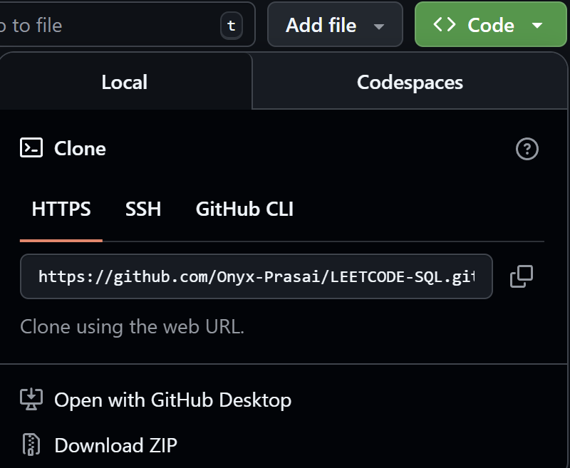
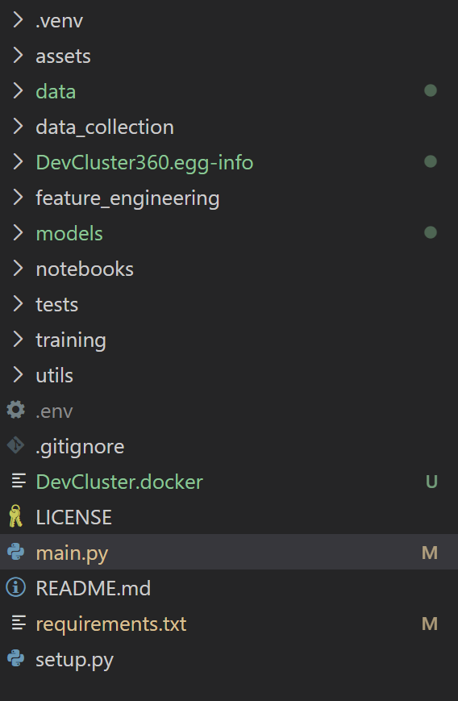

# Clone

Suppose you want to use a github file from your or other's repo(Folder). Here you can clone that repo and use it and edit the file that you want in your way. With this there will not be any changes in that repo as you are not working in that folder but rather you are working in a cloned repo. 
<br>
<b>Basically it is just cloning a repository on our local machine.</b>
<br>

Here we will learn about how we will be cloning a github repo for ourself. For this we can clone it from the local terminal or we can just use our vs code terminal to clone it.

Suppose you want to make some changes on a repository. At first you need to copy the code from the repository.
On hovering or clicking the <>code button you can find a link to copy. Copy that link as shown in the image.


<br>

Then open your VSCode Terminal or local Terminal to copy it in your desired path.

```bash
git clone <"The link provided">
```
In place of <"The link provided"> write the link of the repo you want to clone.
If it is cloned then there terminal shows no erros and hence you have cloned your github repository.

# Check Status
So, after cloning and editing some parts in the code you might find some colored dots beside some files. It shows the status of the project that you just cloned as it is newfile, modified or deleted as shown in the figure below:


<br>

If you want to check the state of the code then you can use the following command in your same terminal.

```bash
git status
```
<h3>Here you have learned to Clone and check status of a Repo.</h3>

[<<Back to Previous Page](./ConfiguringGit.md) <div align="right">[Continue to Next Page >>](./AddnCommit.md) </div>
                


